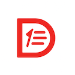

# DAF – Delphi Application Foundations (Community Edition) 

**Bringing modern development practices to Delphi — welcoming .NET developers to a familiar architecture**

DAF (Delphi Application Framework) is a modular and extensible library for building structured, maintainable, and testable Delphi applications.  
It aims to modernize Delphi development by promoting architectural patterns and coding standards inspired by the excellent .NET framework — such as dependency injection, structured logging, CQRS, in-process messaging, configuration binding, and clean abstractions.

DAF is also designed as a bridge for .NET developers entering the Delphi ecosystem, offering a familiar API style and clear, idiomatic structure.  
It fosters openness, collaboration, and community-driven quality.

To deliver on this familiar and modern architecture, DAF models several foundational components of the .NET ecosystem — including hosting, configuration, and logging — following their design closely.  
It also brings in community-proven patterns by porting influential projects such as [NLog](https://nlog-project.org/) and [MediatR](https://github.com/jbogard/MediatR), adapted natively to Delphi.

The Community Edition already includes:

- **Dependency Injection** — based on `Microsoft.Extensions.DependencyInjection`
- **Logging** — based on `Microsoft.Extensions.Logging`, including:
  - **Structured Logging** — with support for log scopes and message templates
- **Configuration System** — based on `Microsoft.Extensions.Configuration`, with support for:
  - In-memory collections
  - `.json` files
  - `.ini` files
  - Binding to custom Delphi classes
- **Host Model** — ports of `IHost` and `IHostBuilder` for application composition and lifecycle management. Includes:
  - **IHostEnvironment** — for environment-based configuration
  - **IHostApplicationLifetime** — for application lifecycle events
  - **IDafApplicationBuilder** and **IDafApplication** — for streamlined access to host services
- **CQRS and In-Process Messaging** — modeled after [MediatR](https://github.com/jbogard/MediatR), supporting commands, queries, and notifications
- **NNLog** — a Delphi-native port of [NLog](https://nlog-project.org/) ("**NNLog is Not NLog**"), fully integrated with DAF's logging abstractions

DAF Community Edition is distributed under the MIT License with an additional attribution clause.  

A Pro edition is available, offering documentation and commercial support.  
Advanced features for DAF Pro are coming soon.

## Editions

| Edition | License | Description |
|--------|---------|-------------|
| **DAF Community** | MIT + Attribution | Free for personal and commercial use, with acknowledgment |
| **DAF Pro**       | Commercial | Documentation and professional support |

See [`legal/COMPLIANCE.md`](./legal/COMPLIANCE.md) for license compliance and usage instructions.

